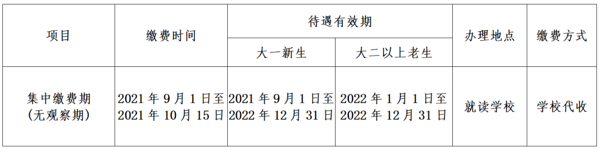

# 大学生医保的待遇有效期是多少？

> 
>
> @微信公众号：成都中医药大学温江门诊部
>
> 2021-09-13 08:00 Posted on 四川
>
> https://mp.weixin.qq.com/s/-AbBdHMkPzhyN75FbqBOnw

相关依据如下：

> 大学新生门诊待遇有效期为入学当年9月1日至次年12月31日。
>
> 本办法自2020年9月1日起实施，有效期5年。
>
> ---
>
> [成都市医疗保障局关于印发《成都市大学生门诊医疗费管理办法》的通知 成医保办〔2020〕33号](http://cdyb.chengdu.gov.cn/ylbzj/c128998/2020-09/07/content_5423e43a96b24022989cfaa9e8628e76.shtml)                               
>
> 生效时间：2020年9月1日

> 自2020年起，参加城乡居民基本医疗保险的大学生参保人员待遇有效期按自然年度计算（**含合并缴费的其他险种**），待遇有效期从保险年度的1月1日起至12月31日止；大学新生参保第一年保险有效期为入学当年9月1日至次年12月31日。
>
> 城乡居民基本医疗保险学生儿童（含**大学生**）参保人员，参加**大病医疗互助补充保险**的待遇有效期，与城乡居民基本医疗保险待遇有效期一致。  
>
> ---
>
> [成都市人民政府办公厅关于调整城乡居民基本医疗保险、大病医疗互助补充保险及重特大疾病医疗保险有关政策的通知 成办函〔2019〕79号](http://gk.chengdu.gov.cn/govInfoPub/detail.action?id=109660&tn=6)
>
> 签发时间：2019-07-10
>
> 生效时间：2019-07-10