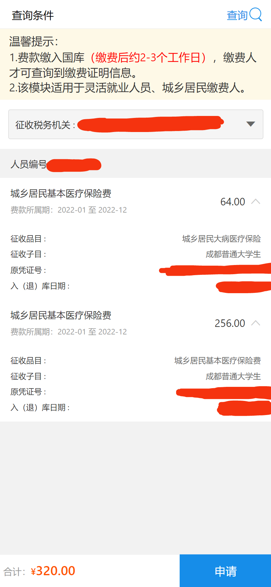

# 如何参加大学生医保？

## 谁负责办理学生参保手续？

> 校医院负责办理学生参保手续。
>
> ---
>
> 微信公众号：成都中医药大学温江门诊部
>
> 2021-09-13 08:00 Posted on 四川
>
> https://mp.weixin.qq.com/s/-AbBdHMkPzhyN75FbqBOnw

## 要交多少钱？

> **大学生**、中小学生、婴幼儿参加我市2022年城乡居民基本医疗保险的个人缴费标准为每人每年320元（含大病医疗互助补充保险）
>
> ---
>
> [成医保发〔2021〕14号](http://cdyb.chengdu.gov.cn/ylbzj/c128998/2021-07/08/content_f20451ee025d4045b49a418c6eca6305.shtml)

另外，还有个好消息：

> 2022年重特大疾病医疗保险不另行筹资。参加我市城镇职工基本医疗保险、城乡居民基本医疗保险且处于待遇有效期的参保人员，继续享受**重特大疾病医疗保险待遇**。
>
> ---
>
> [成医保发〔2021〕14号](http://cdyb.chengdu.gov.cn/ylbzj/c128998/2021-07/08/content_f20451ee025d4045b49a418c6eca6305.shtml)

可以简单理解为：参加了城乡居民基本医疗保险后，将附赠一份赠险（重特大疾病医疗保险）

## 如何查询是否参保成功？

可通过以下渠道查询：

- [国家税务总局四川省税务局](https://sichuan.chinatax.gov.cn/sbjf/)（网站）
- 四川税务（微信公众号）
- 成都税务（微信公众号）

以**四川税务（微信公众号）**为例：

1. 进入**四川税务**微信公众号
2. 点击**办税缴费**-**社保缴费**
3. 点击**四川省电子税务局**
4. 点击**证明开具**
5. 如果参保成功了，就能看到一个值为64元的列表项和一个值为256元的列表项

64元用于交**城乡居民大病医疗保险**，256元用于交**城乡居民基本医疗保险费**。

其中，64元是这样算出来的：

> 已参加成都市城乡居民基本医疗保险学生儿童（含**大学生**）**大病医疗互助补充保险**费，从学生儿童（含**大学生**）个人缴纳的基本医疗保险费中按20%的比例划入**大病医疗互助补充保险**，划入金额为64元。
>
> ---
>
> [成医保发〔2021〕14号](http://cdyb.chengdu.gov.cn/ylbzj/c128998/2021-07/08/content_f20451ee025d4045b49a418c6eca6305.shtml)

320×20%=64